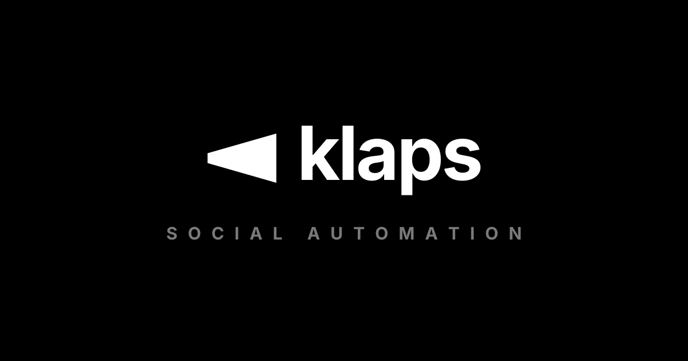

<p align="center">
  
</p>

<h1 align="center">Klaps Radar</h1>

<p align="center">
  <em>Social automation for Klaps — renders screening artwork and publishes it to Instagram, Facebook, and Threads.</em>
</p>

<p align="center">
  <a href="#getting-started">Getting Started</a> ·
  <a href="#how-it-works">How It Works</a> ·
  <a href="#scheduling">Scheduling</a> ·
  <a href="#deployment">Deployment</a>
</p>

---

Klaps Radar picks the best upcoming screening from the [Klaps](https://klaps.space) API, renders a branded image for it, and publishes posts and stories across social platforms. Images are rendered without a browser: [satori](https://github.com/vercel/satori) (JSX → SVG) + [sharp](https://sharp.pixelplumbing.com/) (SVG → JPEG), following the klaps.space design language.

## Getting Started

```bash
bun install
```

Preview the templates (writes `previews/instagram-post.jpg` and `previews/instagram-story.jpg`):

```bash
bun run preview
```

Publish (requires `.env` with `API_URL`, `INTERNAL_API_KEY`, `INSTAGRAM_ACCESS_TOKEN`, `INSTAGRAM_USER_ID`):

```bash
bun run create:instagram-post <dateFrom> <dateTo> [numberOfCandidates] [minScore]
bun run create:instagram-story <dateFrom> <dateTo> [numberOfCandidates] [minScore]
bun run create:facebook-post <dateFrom> <dateTo> [numberOfCandidates] [minScore]
bun run create:facebook-story <dateFrom> <dateTo> [numberOfCandidates] [minScore]
bun run create:threads-post <dateFrom> <dateTo> [numberOfCandidates] [minScore]
```

Scripts invoked without arguments compute the date range themselves (Warsaw time): posts cover the next 7 days, stories cover today–tomorrow — a bare `bun run create:instagram-post` is cron-ready.

## Platforms

**Facebook** requires `FACEBOOK_PAGE_ID` and `FACEBOOK_PAGE_ACCESS_TOKEN` (a system user Page token from Business Manager — it does not expire). A post is a single `POST /{page-id}/photos`; a story is an upload with `published=false` followed by `POST /{page-id}/photo_stories`.

**Threads** requires `THREADS_USER_ID` and `THREADS_ACCESS_TOKEN` (long-lived, 60 days — refreshed automatically on publish like the Instagram token and kept on the `THREADS_TOKEN_FILE` volume). Flow: media container → `threads_publish`; text is truncated to 490 characters (Threads caps posts at 500).

Without the relevant variables the scheduler skips those jobs with a clear log line.

## How It Works

1. `src/utils/candidate.ts` — fetches the best screening candidate from the API (the backend enforces deduplication and a 30-day per-movie cooldown).
2. `src/render/template.tsx` — a single JSX template in two variants (post 1080×1350, story 1080×1920); the movie still comes from TMDB at full resolution.
3. `src/render/render.tsx` — satori + sharp render the JPEG (the image is embedded as a data URL).
4. `src/publish.ts` — reserves the candidate, parks the image in our own API (`POST /socials/image`, public `GET /socials/image/:id`), refreshes the platform token, publishes via the Graph API (container → `media_publish`), and marks the candidate as published.

## Scheduling

The container is a long-running scheduler (`src/scripts/cron.ts`, [croner](https://github.com/hexagon/croner), Europe/Warsaw). Posts are staggered across platforms so followers do not see the same artwork everywhere at once; stories run two slots a day within a single cron expression.

| Job             | Variable            | Default        | Fires at      |
| --------------- | ------------------- | -------------- | ------------- |
| Instagram story | `IG_STORY_CRON`     | `30 8,17 * * *`  | 8:30, 17:30   |
| Facebook story  | `FB_STORY_CRON`     | `45 8,17 * * *`  | 8:45, 17:45   |
| Instagram post  | `IG_POST_CRON`      | `30 11 * * *`    | 11:30         |
| Facebook post   | `FB_POST_CRON`      | `0 13 * * *`     | 13:00         |
| Threads post    | `THREADS_POST_CRON` | `30 18 * * *`    | 18:30         |

`STORIES_PER_DAY` (default 2) is sent to the candidate API as `maxPosts` and must match the number of firing times in the story cron expressions. `PUBLISH_JITTER_MINUTES` (default 0) delays every job by a random 0..N minutes so publications do not land at the exact same minute every day.

## Deployment

A push to `main` builds the Docker image (GHCR) and deploys it to the VPS (`.github/workflows/deploy.yml`).

Refreshed platform tokens live in files on a volume (`INSTAGRAM_TOKEN_FILE=/data/instagram-token`, `THREADS_TOKEN_FILE=/data/threads-token`) and survive redeploys — the `*_ACCESS_TOKEN` secrets only seed the very first run.

Required secrets: `SERVER_IP`, `SERVER_USER`, `SERVER_SSH_KEY`, `PROJECT_DIR`, `GHCR_PAT`, `IMAGE_NAME` (e.g. `ghcr.io/klaps-hq/klaps.radar`), `API_URL`, `INTERNAL_API_KEY`, `INSTAGRAM_ACCESS_TOKEN`, `INSTAGRAM_USER_ID`, `FACEBOOK_PAGE_ID`, `FACEBOOK_PAGE_ACCESS_TOKEN`, `THREADS_USER_ID`, `THREADS_ACCESS_TOKEN`, plus the optional cron overrides listed above.
